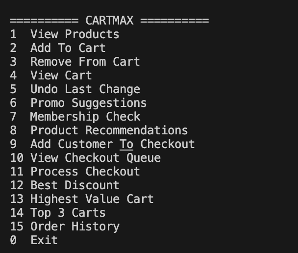

# CartMax E-Commerce System

An advanced command-line e-commerce backend demonstration showcasing the integrated use of classic data structures and algorithmic design patterns in C++.

---

## 2.1 Project Title
**CartMax E-Commerce System**
A C++ Data Structures and Algorithms demonstration project.

---

## 2.2 Problem Statement
Modern e-commerce architectures demand high efficiency and low latency when managing real-time inventory reservations, rolling back shopping state changes, autocomplete lookups for promo codes, and processing checkout queues. Additionally, businesses require optimization mechanisms to determine the most cost-efficient application order for discount vouchers and recommendation engines to suggest bundle deals. 

This project addresses these challenges by implementing a single console-based ecosystem, using custom data structure selections to meet performance requirements and maintain a small memory footprint.

---

## 2.3 Objectives
1. Catalog and Inventory Management: Implement real-time stock allocation and release during user sessions to prevent overselling.
2. State Rollbacks: Provide a quick undo function for cart calculations to revert total price edits.
3. Fast Autocomplete: Enable instant prefix matching for coupon codes to guide users during payment.
4. Process Scheduling: Queue clients in a first-in, first-out sequence for transactional processing.
5. High-Value Customer Tracking: Identify highest-spending clients dynamically to assist customer support.
6. Association Rule recommendations: Connect related items to show product bundles.
7. Coupon Optimization: Implement mathematical discount selectors to choose optimal combinations of multiple coupon types.

---

## 2.4 System Overview / Architecture
CartMax is structured under a unified manager class, CartMaxSystem, which coordinates distinct sub-modules representing backend workflows:

* **Trie-based Autocomplete**: A trie structure indexing valid promotional codes, allowing quick traversal based on character prefix inputs.
* **Rollback Stack**: A double-precision stack tracking chronological cart values to support immediate reversion.
* **Customer Checkout Queue**: A standard first-in, first-out queue representing checkout lines.
* **Membership Directory**: An unordered map storing customer membership tiers to provide customized tier logic.
* **Cart Priority Heap**: A max-priority queue ranking carts by total cart value, allowing instant identification of high-value shoppers.
* **Product Association Graph**: An adjacency list implementation connecting similar products, used to query recommendations when products are selected.
* **Discount Optimizer**: A dynamic programming solver evaluating bitmask states to compute optimal order-of-application for active percentage and flat discounts.

---

## 2.5 Data Structures and Algorithms Used

### 1. Trie (Prefix Lookup Tree)
Used for promo code storage and lookup suggestions.
* Nodes contain an unordered map of character pointers and a boolean flag marking the termination of a code.
* Traversal occurs character by character down the tree, and depth-first search locates potential suffixes.

### 2. Stack
Used for tracking the history of cart totals to enable rollback logic.
* Every operation modifying the cart total pushes the updated subtotal.
* The undo action pops the current value and restores the preceding entry from the top of the stack.

### 3. Queue
Used to sequence customer checkouts.
* Incoming checkout requests append names to the tail.
* Processing extracts customers from the head, ensuring chronological first-in, first-out order.

### 4. Hash Maps
Used for inventory lookup (`productDB`) and customer membership tracking (`membershipDB`).
* Provides average constant-time indexing and modifications by mapping unique IDs directly to objects.

### 5. Priority Queue (Max-Heap)
Used for active cart monitoring.
* Organizes carts by price values, maintaining the highest-valued cart at the root.

### 6. Graph (Adjacency List)
Used to catalog bundled item recommendations.
* Maps a product name to a list of connected items using an undirected graph structure.

### 7. Dynamic Programming with Bitmasking
Used for computing optimal discount sequences.
* Because flat discounts and percentage discounts yield different totals depending on the sequence in which they are applied, the problem exhibits overlapping subproblems and optimal substructure.
* The state is represented as a bitmask where the i-th bit indicates whether the i-th coupon has been applied.
* A DP array tracks the minimal achievable price for each state, updating transitions iteratively.

---

## 2.6 Implementation Approach
The project is built entirely in a single source file, `main.cpp`. The layout isolates the models, data structures, implementation methods, and console interface:

* **Structures**: Data representations for Product, Coupon, CartItem, and TrieNode are declared as structs at the top.
* **CartMaxSystem Class**: Manages all private databases (the Trie root, stack, queues, maps, heap, and graphs) and exposes public API endpoints for system actions.
* **Destructor Lifecycle**: Ensures all dynamically allocated memory in the Trie is cleaned up recursively to prevent leaks.
* **Interactive Shell Loop**: A menu-driven console loop in the `main` function allowing real-time interaction with all core routines.

---

## 2.7 Time and Space Complexity Analysis

| Data Structure / Subsystem | Operation | Time Complexity | Space Complexity | Details |
| --- | --- | --- | --- | --- |
| **Trie** | Insertion | O(L) | O(L * S) | L = length of promo code, S = character alphabet |
| | Suggestions | O(P + N) | O(N) | P = prefix length, N = nodes in matching subtree |
| **Stack** | Undo Rollback | O(1) | O(U) | U = number of cart operations |
| **Queue** | Checkout Sequence | O(1) | O(Q) | Q = number of customers waiting |
| **Hash Map** | Lookup / Update | O(1) average | O(M + P) | M = total members, P = total products |
| **Priority Queue** | Heap Push / Pop | O(log C) | O(C) | C = number of active carts tracked |
| **Graph** | Node Association | O(1) | O(V + E) | V = products, E = bundle relations |
| | Recommendation | O(D) | O(1) auxiliary | D = degree of connections for queried product |
| **Bitmask DP** | Discount Evaluation | O(N * 2^N) | O(2^N) | N = number of coupons |

---

## 2.8 Execution Steps

### Prerequisites
* A standard C++ compiler supporting C++17 (such as GCC/G++ or Clang).

### Compilation
Compile the source file using a terminal environment:
```bash
g++ -std=c++17 main.cpp -o cartmax
```

### Execution
Run the compiled executable:
```bash
./cartmax
```

---

## 2.9 Sample Inputs and Outputs

### Adding Items to Cart
```text
========== CARTMAX ==========
1  View Products
2  Add To Cart
3  Remove From Cart
4  View Cart
...
Enter Choice: 2
Product ID: P1
Quantity: 1

Item Added Successfully
```

### View Cart Subtotal
```text
========== CARTMAX ==========
...
Enter Choice: 4

===== CART =====
Laptop | Qty: 1 | Rs.50000

Total: Rs.50000
```

### Prefix Promo Autocomplete
```text
========== CARTMAX ==========
...
Enter Choice: 6
Enter Prefix: SAV

SAVE10
SAVE20
```

### Finding Optimal Discounts
Given a cart of Rs.50,000 and coupons `SAVE10` (10% off), `SAVE20` (20% off), and `FLAT500` (Rs. 500 off):
```text
========== CARTMAX ==========
...
Enter Choice: 12
Best Discount: Rs.14500
```
*Mathematical calculation trace: Apply 20% off first (50000 -> 40000), then apply 10% off (40000 -> 36000), then flat Rs. 500 off (36000 -> 35500). Total discount = 50000 - 35500 = 14500.*

---

## 2.10 Screenshots
Here is a screenshot of the initial program launch menu and interactive CLI interface:




---

## 2.11 Results and Observations
* **Prefix Matching Efficiency**: Using a Trie instead of linear substring queries on strings keeps autocomplete times constant relative to dictionary size.
* **Undo Reliability**: The state tracking stack successfully reverts errors instantly.
* **Combinatorial Optimization**: The Bitmask DP solver evaluates discount ordering accurately. It automatically factors in percentage-on-subtotal decreases before flat discounts, yielding the most beneficial reduction for the buyer.
* **System Modularity**: Exposing individual components through a clean API inside a controller class allows easy integration into GUI frameworks or API servers.

---

## 2.12 Conclusion
The CartMax system integrates core data structures and algorithmic designs into a functioning console e-commerce simulation. By mapping individual problems (inventory lookup, states, queues, recommendations, and discount calculations) to optimal data structure models (Hash Maps, Stacks, Queues, Graphs, Priority Queues, and Dynamic Programming), the program demonstrates key engineering tradeoffs in runtime complexity and memory management.
